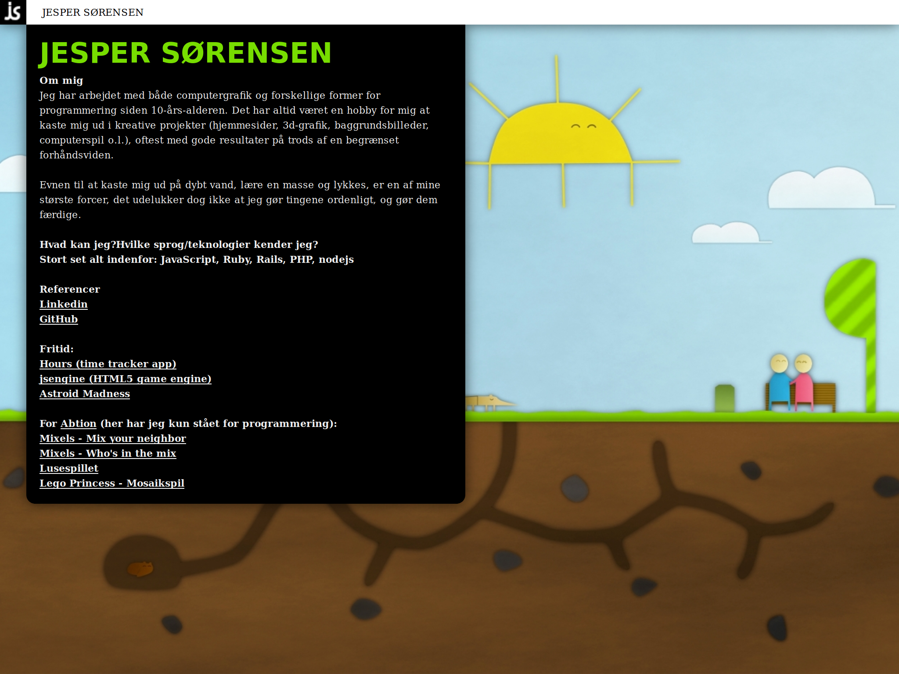
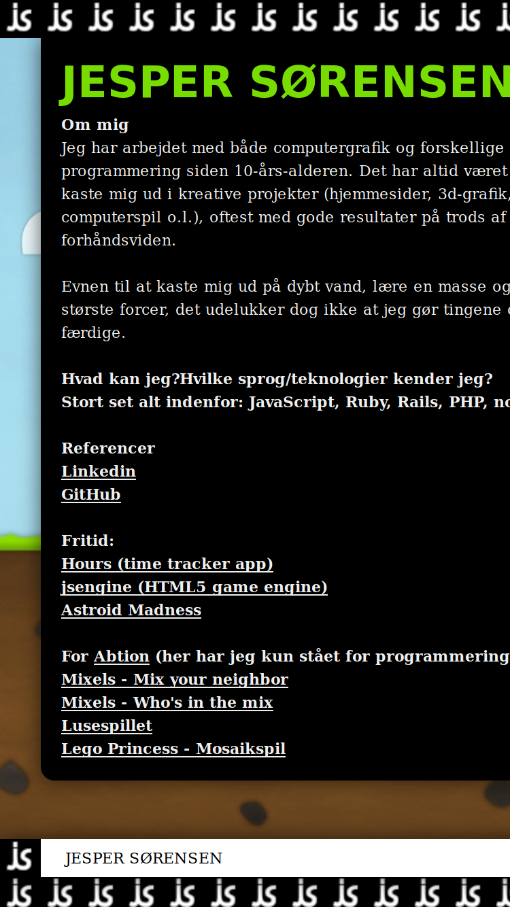

# I made this site

My old site lasted nearly a decade, but truth be told, it was left outdated for way too long.

Here are a couple of screenshots that I'm not proud of:

_In it's glory on a desktop. At some point, I WAS actually quite proud of this_

_Quite a beauty on a smartphone_

In an attempt to avoid such a fate for this new site, I'm trying something else: Rather than being a crappy half-clone of my linkedin profile, this new site will instead be a showroom for some of the side projects I'm working on.

A completely intended side effect is that I also get to treat my urge to share all these projects - even those unworthy of any attention.

I already have a small list of projects that I want to cover:

- My own project management system
- The probably not very inventive in-home open floor plan office L-shape wall
- How I'm hopefully solving the problem of daunting grocery shopping lists
- My android time tracker; Hours
- Home made TV furniture - and how a new TV almost ruined it
- More will follow

Since this is the first post about a thing I built; this website, here's also a description of the technical side of things.

I use [pug](https://github.com/pugjs/pug) and [sass](https://github.com/sass) for html and styling. There are a bunch of frameworks for these things, I happened to choose those two this time, I'm not very religious in that regard.

Posts are written in markdown, because I think it's a nice format for writing text content.

Whenever something* is pushed to the repo, a webhook notifies my VPS which will update it's local repo, and then rebuild the site.
When built, the site is completely static, save the hook.

_*Currently "something" means everything, so even a push to a feature branch will trigger a rebuild, I'll improve that later._

The project is stored on [github](https://github.com/jeppester/jsorensen), and is open for everyone to look at and judge.
If you feel a strong urge to contribute, I have no clue why anyone would like to that, it IS also possible to make a PR.

I'm hoping that this simple flow will allow me to focus on content rather than maintenance - time will tell if I'm right about that assumption. Otherwise I've at least managed to switch from an ugly old unmaintaned site, to a less ugly newer unmaintaned site, which is also some sort of achievement :-)
