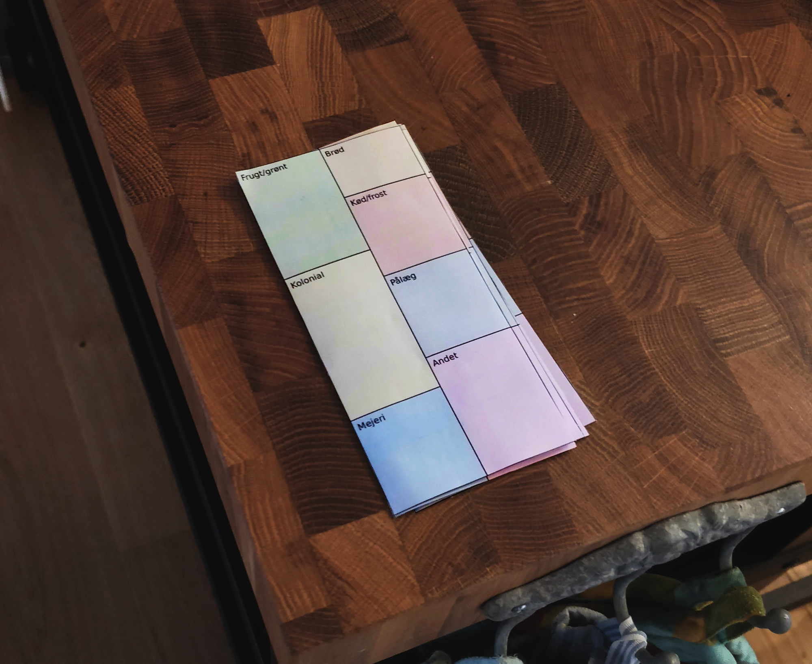
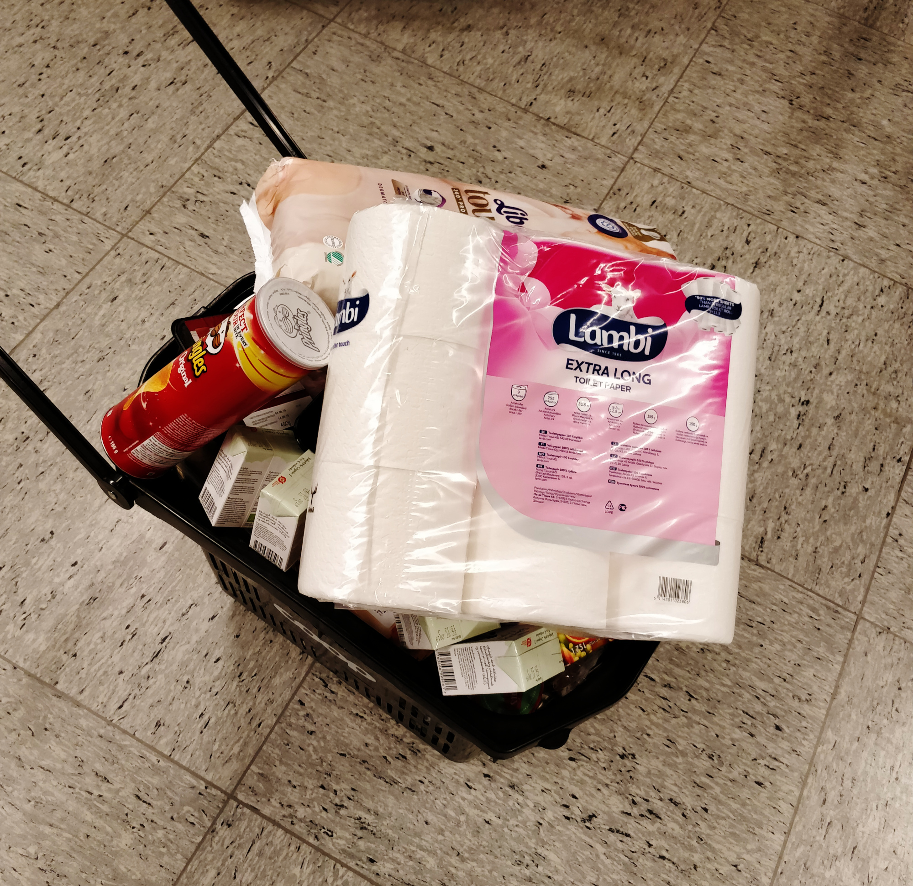

# An improved grocery list

Here's how it's usually been when we've shopped groceries:

1. It's sunday, we should really figure out what to eat for the next few days, a shopping list is written - Ida (my girlfriend) is really good at this!
2. Ida or I goes shopping. Note: The following is the experience when I am the person who goes shopping.
3. The list is overwhelming, things are not ordered in a clever way (how did this happen? we tried our best), I forgot a pen to mark the things I already grabbed, better try to remember, it's already been 20 minutes! I still miss two things... finally! done!
4. Home. In the meantime Ida found out that we ran out of dipers, and I forgot to buy tomatoes.

Even though it's been working out fine for years, I decided a few weeks ago that it was time to try to improve the flow.

And since I'm [ignorant](https://www.freeprintablegrocerylist.com/preview/Master_Grocery_List) [about](http://www.grocerylists.org/ultimatest/) [all](https://www.pinterest.dk/explore/grocery-lists/) [other](http://www.workingmom.com/grocery_list/) [solutions](https://templates.office.com/en-us/Grocery-list-TM00000030) [already](https://www.freeprintablegrocerylist.com/preview/Master_Grocery_List) [invented](http://www.mygrocerychecklist.com/) [by](https://thepounddropper.com/shopping-lists/) [other](https://www.bestproducts.com/eats/food/g1505/grocery-shopping-list-apps/) [people](https://www.pinterest.com/pin/302233824967296778/), behold!:

_The improved grocery list_

Features:
- Colors: Pleasing on the eyes
- Categories: Add stuff to the correct category as you run out of it, don't worry about order anymore
- Categories again: Buy all the stuff one category at a time, cleverly ordered, the same every time
- Categories again again: Rip categories from the sides as you are done with them, no need to bring a pen

So far it's been a noticable improvement. Yesterday I went shopping, tired after a long day, not the best of moods, my 10 months old son crying in the car all the way to the mall, and then I bought all this:

_And I was only cranky for the first few minutes!_

Only problem is having to print and cut out more of them every once in a while. Time will tell if it the printing/cutting effort outweighs the cool features.

Download the list (six lists per A4 sheet) as [pdf](grocery-list.pdf) and start shopping for cool nordic stuff like brød, grønt, kød or pålæg... or download the list as [svg](grocery-list.svg) and invent your own exotic words, or just translate it to your language.

The tools: I made the list with one of my favorite open source utilities: [Inkscape](https://inkscape.org/). I especially love the path editing tools! - Though I didn't use them much this time.
