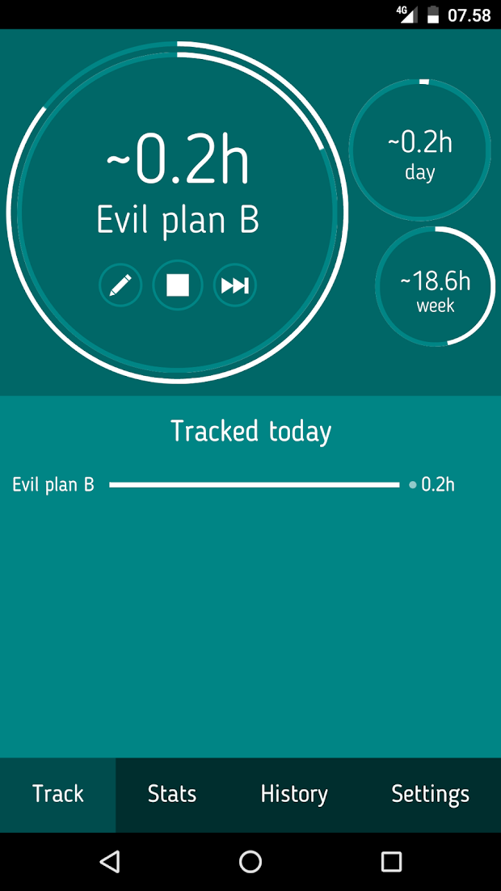
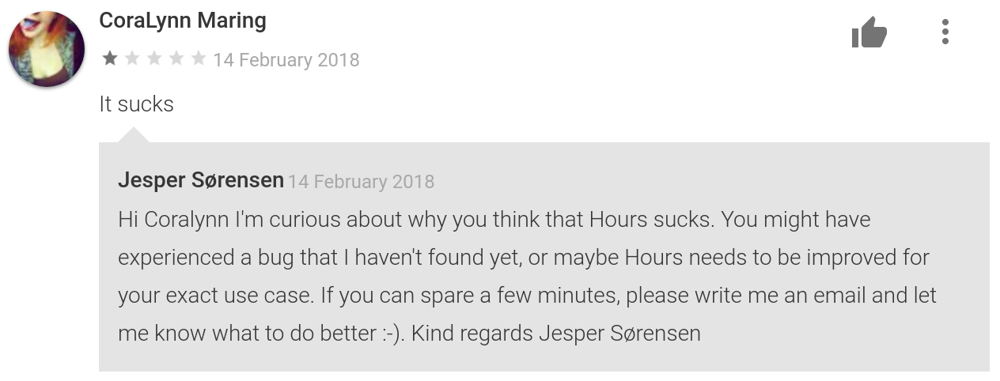

# Hours - a time tracking app

Back in 2015 I was in love with [project hamster](http://projecthamster.org/).

It looks like it hasn't received a lot of love the past couple of years, but it is absolutely great, here are a few reasons:
- It's free (it's for linux though)
- No registration, just start tracking your time
- No need to create clients, projects etc. a registration just needs a title - tags are available though
- Data is stored locally, no big brotherish cloud
- Simple but sufficient stats and export options

Unfortunately the "data stored locally" feature became an issue for me, because I had to split my working hours between two machines; my laptop (while commuting), and my office desktop.

So I figured: What if project hamster was an app for my phone? That would allow me to use multiple computers, while still avoiding cloud accounts, surely such an app would already exists!

Yes, and no... There were a multitude of time tracking apps for Android, but the only ones that came close to project hamster (in my opinion) were either paid or full of ads.

So, you guessed it, I decided to build my own time tracker! For my self to use, but also for everyone else who was looking for the same features as me, maybe also migrating from project hamster.

I struggled with cordova for a couple months - the best cross platform app development option at the time - and I switched the name a few times, "Yieldy" stuck for a while as in the meaning of being productive, but it deterioated as its other meaning; to give in/up, became more obvious to me. Then by March 2016 it was finally ready for Google Play, by the name: [Hours](https://play.google.com/store/apps/details?id=com.jsorensen.hours).

You can read all about Hours and even try it out if you follow the link :-)

_The main view while something is getting tracked, you CAN change the color theme_

If you happen to use iOS and you noticed that I mentioned "cross platform" earlier, then I'm sorry to have to disappoint you. I initially intended to release Hours for iOS as well, but to compile for iOS you have to use xcode, and therefore also own a mac, or borrow one, or run a virtual machine etc. This is a purely artificial limitation, and such things trigger my inner rebel, and I can be a biiit stubborn. So in the end I decided to "punish" Apple by only releasing for Android - I'm sure it hurt!

Since then I've had the pleasure and sometimes pain of following and nurturing Hours' growth towards ~2300 users, where it's been lying stable for the past few months.

So how does it feel to maintain an app? I'll start with the bad, so that we can end on a happy node:
- Negative reviews with no feedback at all. What is the purpose of this?
- Users who feel entitled to demand changes to the app, even though they got it for free.
- Keeping the app working; updating cordova, finding alternatives to broken plugins etc. Whenever I decide to finally implement some improvement I've thought about for a while, I end up first spending a lot of time on bringing the app up-to-date.

_CoraLynn's extended feedback got lost in the mail, I think_

The good stuff - far outweighing the negative:
- Giving people something valuable for free
- Positive reviews, who doesn't like praise?
- Adding stuff that people asked (kindly) for, and getting rewarded with more praise.
- Generally users are just really helpful! One time a hero beta tester saved everyone from broken excel export, and me from having to deal with such a disaster. The same user even found my paypal account and made a donation. If the world was upside down, and apps were reviewing users, Hours would rate him 5/5.

Because of those things I have never regretted to release and maintain Hours - even if it doesn't generate income in any way (apart from said donation). I'm privileged to have a "real" job on the side, so I don't need any extra income, but I can only recommend having such projects to others who are equally privileged. Actually it really felt like a breath of fresh air to me, to not have to weigh each spent hour's profitability.

I've already mentioned cordova, but here's a more in depth description of the technical side of things:
- Cordova + plugins for file system and share dialog
- Backbone.js
- Pug for HTML templates
- Stylus for CSS

Today I would instead have used React native, or NativeScript, or - having known that I would later decide to drop iOS support - I would have just written a native Android app.
