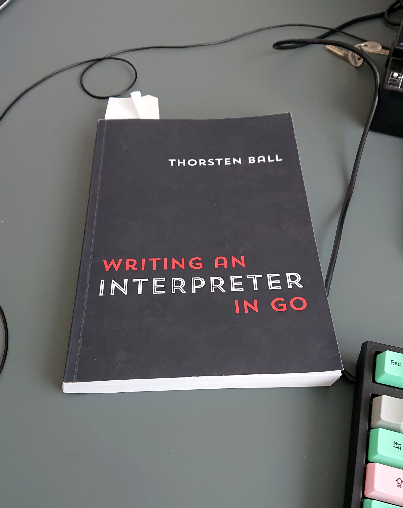

# I'm building an interpreter in rust

I really don't like not to know how things actually work.

So it's been bothering me for a while, that I - someone who's been building stuff with code for more than a decade - know shockingly little about how things work below the powerful abstractions provided by my languages of choice: javascript, ruby, php, java etc.

Let's just say that uncovering more about what's actually going on has been on my todo-list for quite some time.

Then a few weeks ago a good friend of mine recommended [this book](https://interpreterbook.com/), and the timing was perfect in regards to my vacation! So I immediately went ahead and bought the book on cheaper german amazon and it arrived last friday; my last day at work (coincidence? - I'll let you be the judge).

_The book, in it's current spot on my desk_

The book explains a thing or two about how programming languages are interpreted, which is really great. But - now that I'd decided to actually do something about my ignorance - I thought: why not go even further? So I cranked the challenge up a notch and decided to learn rust on the side. Basically following the book, replicating it's go-code in rust - with the challenges it brings.

The first few pages were REALLY tough! I tried to store a generator on a struct, but the borrow checker was immediately on my ass. Then I found a bunch of good advice that I couldn't understand because I first had to learn a bunch of terms, which I then had to read up on... I wasn't exactly having a blast, and I wanted to give up - for the first of a few times.

Eventually I concluded that maybe the borrow checker was right, and I was wrong, or at least it led me to the realization that I obviously wasn't ready to use rust in "clever" ways yet.

Now I'm ~50 pages in, slowly getting more and more comfortable. I've build a lexer and a repl, and I'm trying my best to turn my tokens into an AST, and also worth mentioning; I've learned more about what each of those things are.

Though I'm slightly worried that the tree structure of the AST will lead to yet another moment of wanting to give up, I'm slowly learning how things work on a lower level than ever before, and I couldn't be happier about it! :-)

You can follow my progress, or lack thereof on [github](https://github.com/jeppester/rust-interpreter).

I also might write a followup post, or two, if the rust affair becomes a longer running thing.
