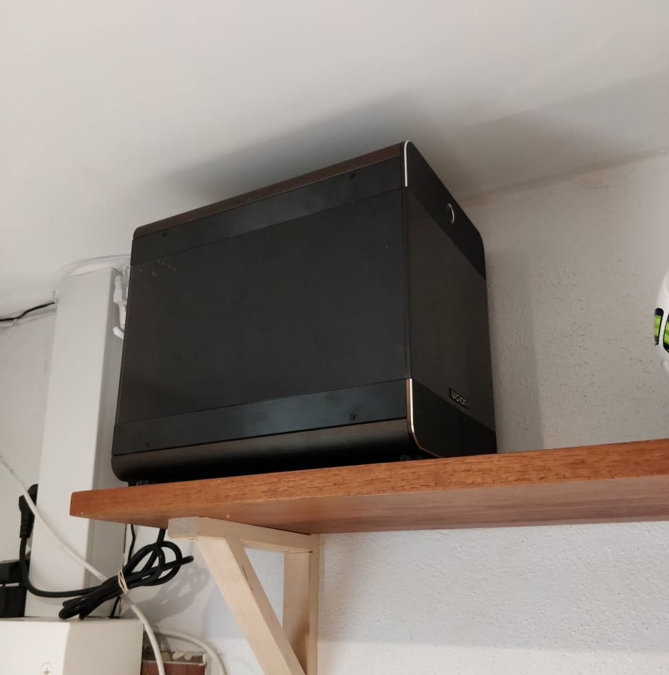
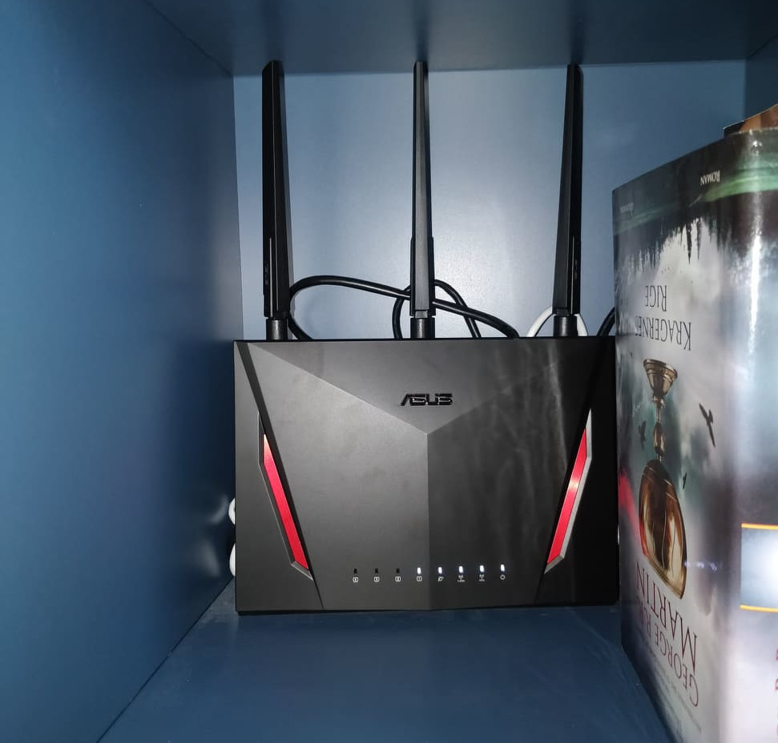

# My new old development server

A colleague of mine one day told me - with much exitement in his voice! - that he moved his development environment into the cloud.

Instead of having projects stored locally they were now stored on his VPS, and using Visual Studio Code's remote plugin, he could have his editor running locally, while everything else was running on the VPS.

I told him that I couldn't imagine that working well on a wireless connection, but he was quite confident that it was not a big deal, and he was even bragging about how long his macbook pro could now last on it's battery, not getting warm at all.

Could it work well, It was quite an interesting setup. But it did have some downsides that bothered me a bit. For instance I didn't like the idea of having client projects stored in the cloud. And I didn't like the idea that any webserver I would run would be accessible to everyone... Now that I'm writing this, I'm thinking that an SSH-tunnel could perhaps do that part of the job, but it wasn't something I stumbled onto in my search for knowledge. Most blog posts didn't cover it, or it would be mentioned and shrugged off like it was a tiny thing - which I don't think it is at all.

Anyway, I didn't really like the whole cloud thing, so I abandoned the idea. But not for long, because a few days later I suddenly got a great idea, one that even involved recycling!

Like a lot of people (perhaps mostly the kind of people that I work with) I had an old work desktop pc lying around that I didn't have a use for - It occurs to me that I'm making this kind of build-up quite often; explaining the circumstances and my thoughts to the point where the idea becomes obvious and the unveilling of it not exciting at all.

So I thought, why not set up the computer as a home server behind a VPN server? That would allow me to reap the benefits of remote development, in a secure environment, and knowing where the data is.

But!:
- Wouldn't running a home server make the power bill explode?
- How would you set up the VPN server?
- Is that at all stable enough?

_I set up a new shelf for the former office desktop, now dev-server_

Let's start with the power bill: It's actually cheaper than buying an equally powerfull VPS - if you have the hardware and a fast enough connection that is. My computer uses 100-150 watts (I removed the dedicated graphics card, otherwise the figures would be a LOT different).

Running 24/7, that is worst case 150 watts * 24 hours * 30 days = 108000 watt hours = 108 kWh. In Denmark power is ~2 DKK per kWh, making it nearly 220 DKK / month. A brief look at Digital Ocean's prices reveals that their cheapest offering with four threads and 8 gigs of memory is nearly 275 DKK. And that's not even a dedicated server.

With that out of the way, what about VPN? I could probably have solved it in a cheaper way, but I went for convenience, so I replaced my router with one offering built-in VPN server (an Asus RT-AC86U). It was very easy to set up, and so far has worked flawlessly, I don't think my single connection is stressing it at all.

_The new router - and most importantly VPN-server - on the bookshelf, where it's usually hidden away behind books_

So how stable is it? I've used it for a week, and the only problem so far was me accidentally deleting a certificate for the VPN-connection. In layman's terms; locking the house and throwing away the key = not the door's (VPN's) fault.

I do have cabled fiber connections both at home and work, but still I am overly impressed that my terminal keypresses travel; from my work, to my home, and back, and then shows up on my screen so fast, that it's absolutely impossible to notice.

Also, my 6 years old desktop has noticably faster compile times than my not very old laptop - in it's defense it also isn't running a desktop environment and a bunch of cool (fat and slow) electron apps.

There are still some rough edges that I have to soften somehow:
- tmux and clipboards are a bit of a pain
- I am missing meld, and have no clue what I'm doing in vimdiff
- Chrome doesn't understand that my development server is perfectly trustworthy, how can I tell it to treat "dev-server" like "localhost"?
- An ssh-agent and my key is not automatically loaded when I log in (I will surely find a way to do this!)

But overall I'm quite happy and excited (hence this very long article) - Btw. please reach out to me if you have all the solutions!

Here are some technical details and things to try out:
- tmux: Panes in SSH, and the ability to come back and continue where you left off, some learning curve
- mosh: Like SSH but jumps effortlessly between networks, and cheats you into thinking that your keypresses happen instantly - this is only noticable when the connection is slow
- vscode + remote ssh: Use the editor like you normally do, but edit files on the server - This works way better than mounting a remote directory
