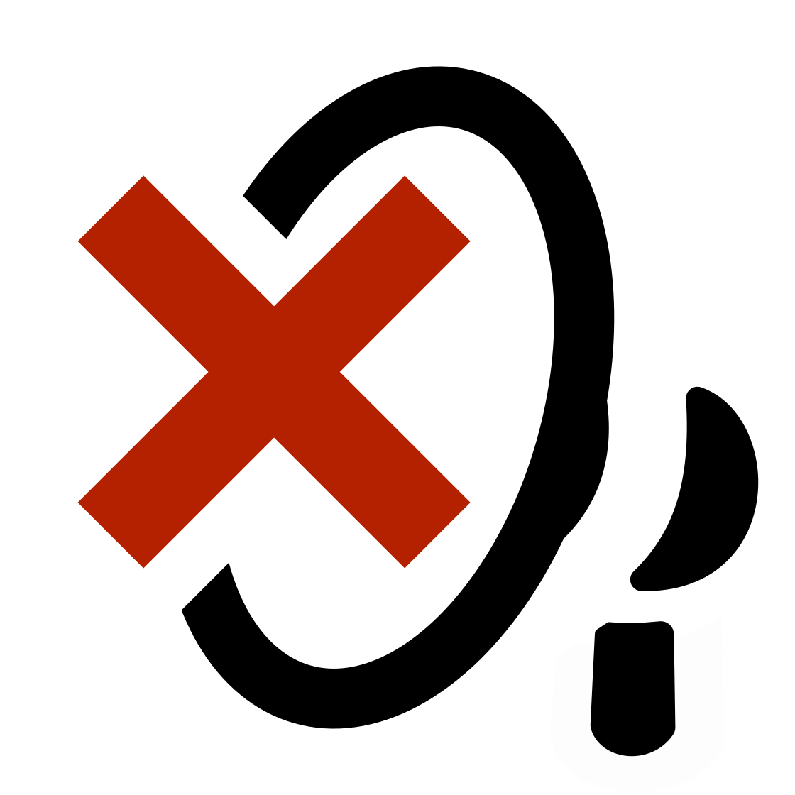

# News Filter

I got really tired of seeing corona-virus news!

I absolutely understand the graveness of the situation, and I do my best to not catch or spread anything myself. However, I don't think that reading about corona all the time does much good to me, and it feels like the news sites are happily making a fortune out of milking and feeding everyone's anxiety.

So I decided to do something about it!

May I present to you:

_News Filter_

News filter is an extension for Chrome (or related browsers) which helps you avoid the news items you don't want to see.

So if you are tired of corona, add it - and covid-19, lockdown, outbreak etc. - as a keywords and enjoy your internet with much less of all that.

_Corona almost gone_

Other ideas for things you can live happier without:
- "early signs of" (some disease)
- terror
- shooting
- dead (articles about car accidents etc.)

I cannot promise that News Filter will catch everything, but it'll do it's best - especially to not filter anything unrelated.

And, if you know a thing or two about web development, you will be happy to know that:
> _It's ALL about CSS selectors, and you can tweak to your heart's content!_

While you are still absolutely excited, right click [here](news-filter.crx) and press "Save link as..."

And to install it:
1. Go to *chrome://extensions* - you have to type this yourself in the address line
2. Enable developer mode in the top right corner
3. Locate the CRX-file you downloaded before, then drag into the extensions page in the browser window

And now that there's a 100% chance that you've installed it; Since I made News Filter mostly for myself, there are some rough edges:
- It comes prefilled with some very Danish keywords for now
- There are probably some bugs - I'll do my best to improve it over time
- I'm not sure if I'll invest time and effort to publish it in Chrome Web Store - Even though this would make the install way easier!
- A firefox version is not on the radar

Remember however; I did take the time to package the extension for you!

And even better and most important: **News Filter is Open Source**. You can find the code right on [github](https://github.com/jeppester/news-filter), and I will be more than happy to receive PRs.

Cheers to a happy and slightly less frightening time with News Filter on.
