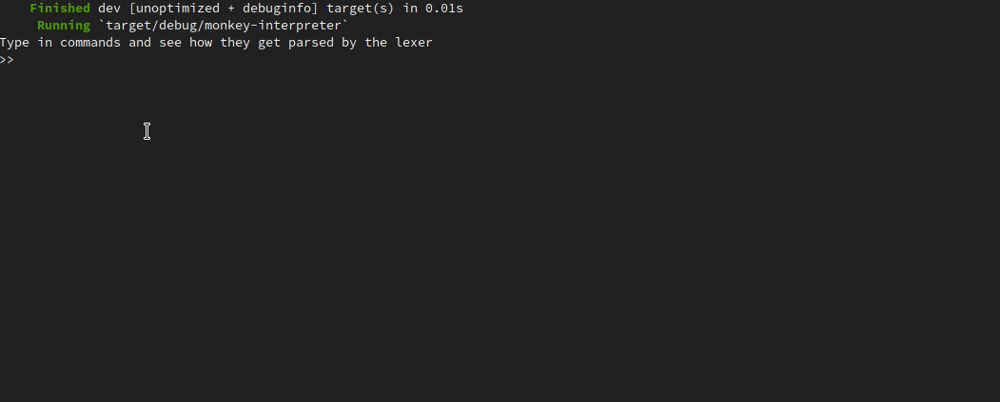

# A quick update on my rust adventure

Back in August I wrote a post about [building an interpreter in rust](i-m-building-an-interpreter-in-rust.html).

I ended it with:
> I also might write a followup post, or two, if the rust affair becomes a longer running thing.

So now that it's been almost a year, I think it's time to stop and take a deep breath, to be honest with myself: Has rust become a longer running thing?

Fortunately the answer is: YES!
The affair metaphor doesn't really fit anymore though; rust has instead become like a good friend that I visit every now and then.

I don't visit rust as often as I would like, but it's always a joy when I do.

Did I get anywhere then? also yes: I managed to get halfway through the [book](https://interpreterbook.com/) - 131 pages worth of GO manually translated into working rust.

It means that I now have a functioning parser, which in turn means that I can parse my code into meaningful AST.

I can:
1. Type in code
2. Type enter
3. The code is turned into an AST which is then turned back into a string

And it truly feels like an achievement every time it happens!

Check it all out [here](https://github.com/jeppester/rust-interpreter)*

Here are some things I've learned during my time with my good friend rust:
- Building low level code without memory issues is difficult - it is REALLY easy to make mistakes
- ^ Rust really helps you avoid making those memory related mistakes
- It's wise to think about where data belongs in rust, as data cannot belong multiple places - Coming from languages with garbage collectors, this felt awkward at first, but then started to make a lot of sense.
- Rust can sometimes be very verbose, macros can help.
- I wish I'd known about the "?" operator for result/option handling when I started.

I feel like I've learned many more things, that I could have added to the list, if I took more notes. I should probably start taking more notes.

Anyway; this was all I wanted to share this time. I hope to have the next rust post ready in less than a year!

_* Though I must shamefully admit that I haven't yet managed to add a README to the project._
