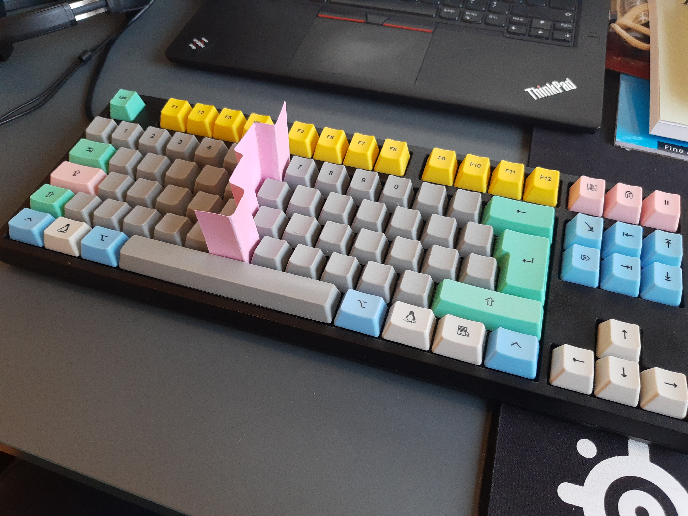
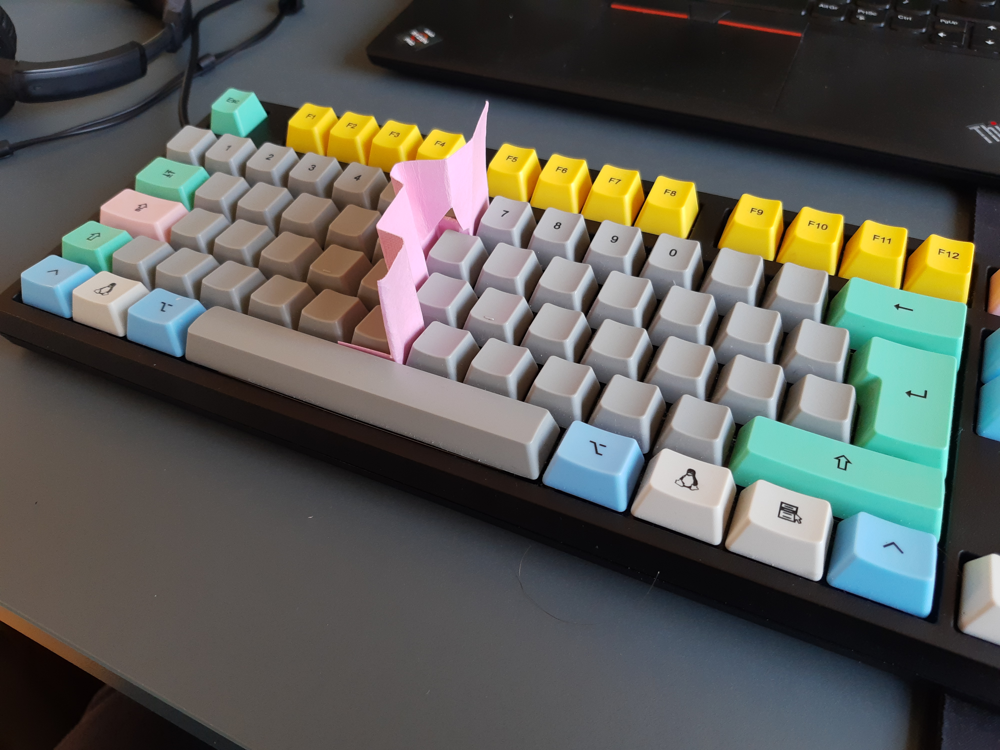
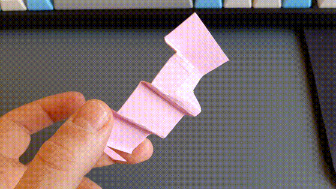

# Breaking bad typing habits with this one weird trick

I have a bad habit of typing Y's and H's with my left hand.

That might not seem like a big deal in itself, but I'm not very fast at typing, and I think this small oddness plays a big part in that.

My bully left hand pushes the right into a sort-of in-between-keys position, causing many of my keypresses on the right side to be done with the wrong fingers.

The result is that I often hit the wrong letters, and my typing speed suffers greatly from:
- Having to delete wrong chars
- The added mental strain of double checking most of the letters that I type.

I really want to break that habit!

So for the past months I've been playing with the thought of buying a split keyboard, just to force my hands to type the chars that they are meant to.
Those are however often really expensive, it's hard to decide which to get and so on.. in the end my wish to do something about this problem was left unfulfilled.

That was until the other night... I couldn't sleep, and then out of nowhere I thought: "Instead of buying a keyboard can't I just bend a piece of paper?". As I wasn't really actively thinking about that specific problem, the thought came as quite a surprise. The brain is a strange mechanism.

However, the next morning, after just a few minutes of cutting and bending cardstock paper, Keyboard Divider v1 was ready:

_KD1_

As you might have guessed the following day of work was a frustrating experience to get through. I can't count the number of time I wrote "tge", "tgis" and "tgat", and my right index finger seemed sort-of afraid to hit the Y-key, I felt like I had to convince it every time: "Don't worry little finger, the bully has been fenced off".

I did however also find a two real issues with KD1 that I had to solve:
1. The number 6 had become almost inaccessible
2. I had to bend my left index finger in an odd way to hit B

Luckily both of those problems was solvable with a little DIY skills so soon KD1 had been upgraded to KD2:

_KD2_

_"The most advanced keyboard devider yet"_

I've been writing this post with KD2 in place. Though I can't say it's been a complete pleasure, the frustration has already declined a slight bit, and my right index finger is starting to gain more confidence, which is great!

Who knows, maybe I'll write a second part to this post someday, featuring KD3, or 5, or 2000.

**Bonus info**:
While writing this post, and coming up with the name, I did some googling, and it turns out that I was actually [not the first](https://www.thingiverse.com/thing:1646063) to [come up](https://ao2.it/en/blog/2009/12/29/keyboard-split-typing-speed) with [this idea](http://www.fantti.fi/NF/Use/use.html).

That can't kill my happiness with this invention however, and I hardly doubt that KD2 would beat the competition any day B-)
