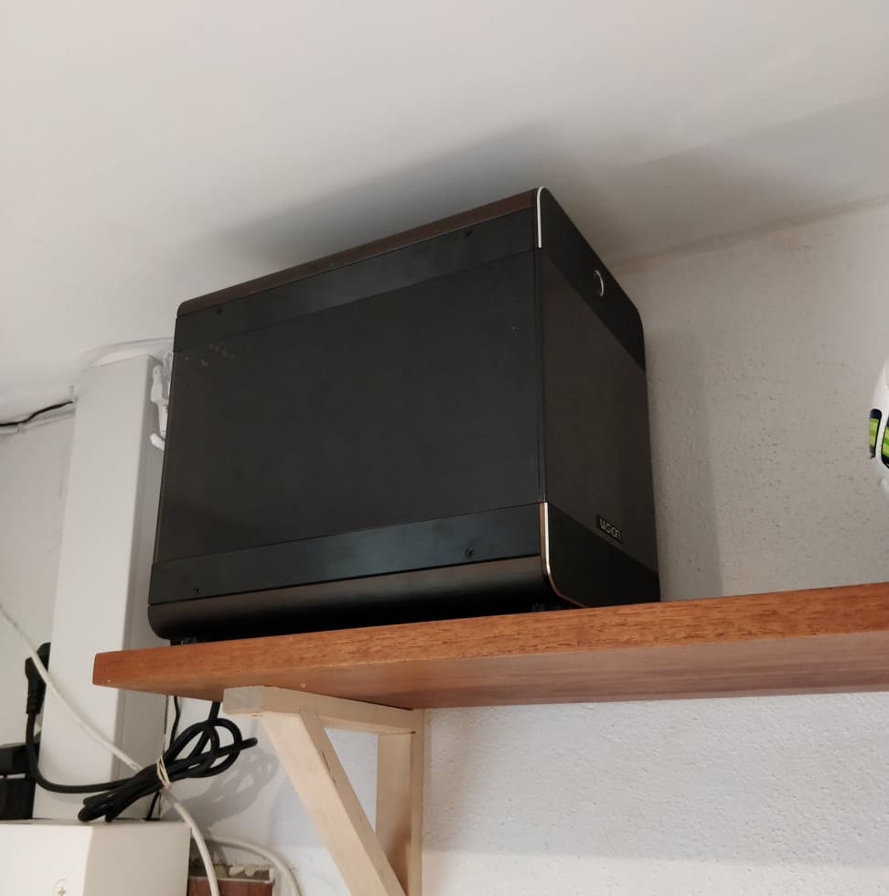

# Two years with the dev-server - part 1

I recently had a look at my website, and I was honestly very surprised to see that [my-new-old-development-server](my-new-old-development-server.html) is now two years old!

I think it makes sense to revisit the development server, and provide an update of how it's been:

- Am I still using it?
- Did I find solutions for the issues I had?
- Did I run into other problems along the way?
- Some other stuff that I want to share, but don't know how to phrase as an intriguing question.

It would surely have been nice to see all these bullets answered in one action packed post. But... I started writing, and at some point I must have forgotten that I was writing a post and instead started writing a novelle. I have now become too attached to said novelle to just throw it out.

What I'm trying to say is that there will be - hopefully only - two blog posts.

In this first one I'll go over the first three bullets, enjoy :-)

## I love my dev-server

I recently spoke to a developer friend of mine, and the dev-server came up as a topic (definitely not me bringing it up!).

He asked me: "How long have you been using it by now? is it sustainable?". I folded my face into a thinking expression for a short while and then answered "I think it muuust have been at least a year". It turns out that I was technically right, but pretty far from precise.

As mentioned it's been two years since the first post, and I AM still using it. I love it and love to talk about it. It's still a pretty rare setup, and I think it deserves more attention.

The biggest change I've made in those two years is that I upgraded the amount of RAM from 8GB to 16 - to make it pleasant to run a Windows 10 VM (YES that is perfectly possible and works great). The machine still holds up very well against modern laptops, which is just mighty impressive given that it must be now ~8 years old.

_The dev-server looks the same as always so I reused my old photo - for the environment of course_

## I found solutions but also ran into issues

Here's the list of my original complaints:

- tmux and clipboards are a bit of a pain
- I am missing meld, and have no clue what I'm doing in vimdiff
- Chrome doesn't understand that my development server is perfectly trustworthy, how can I tell it to treat "dev-server" like "localhost"?
- An ssh-agent and my key is not automatically loaded when I log in (I will surely find a way to do this!)

### I never got around to make my remote and local clipboards shared

If I need to copy something I use the mouse selection of my local terminal. If the targetted text spans a few lines I full screen my current tmux pane before selecting, so that I don't get text from multiple panes. In the rare case that I need to make a selection which is larger than the screen, then I pipe it to a file and read the file in my editor (just adding `> op.txt` to whatever command that wrote the output).

### Meld?

With coolness in my voice I can tell you that I've mastered vimdiff and is now wearing a black vim belt - call me Jesper-san...

No...

I am however merging with VS Code, and it works well enough for me. It was actually fun to see this issue mentioned since I'd just about forgotten that meld exists.

### Browsers are still not trusting non-local hosts and it is still a pain

There are however workarounds, like proxying the server port to local host. Still I wish there was a config for trusted domains. Software should trust powerusers to know what they are doing.

### The SSH-agent issue was fixed long ago

I don't remember exactly how, but nevertheless using SSH is now problem free.

### BONUS COMPLAINT: I wish I didn't have to run browser tests headlessly

This is the most annoying issue I have: I can't see what's going on in end-to-end tests.

It's not a frequent annoyance but it happens every now and then that I just can't get a test to not fail. When I then finally accept my defeat and install the project locally, the cause of the issue is revealed within minutes.

It DOES help to have selenium capture video and screenshots, but it requires effort setting it up. Also I need to get the footage to my local machine in order to view it.

### BONUS COMPLAINT 2: Like browsers, development servers prefer localhost

It was a annoying surprise the first time it happened; I upgraded `rails`, and then my project would suddenly not allow connections to `dev-server`.

Fortunately, unlike the browsers, the development servers trust their users. So fixing it was pretty simple.

What I usually do now is to patch projects to allow adding trusted hosts through an env var. So no hardcoded `dev-server` anywhere, just 1-2 lines of codes added to allow any setup like mine.*

_*Btw. this change also makes it possible to easily share a local server through a remote proxy like ngrok_

## The other stuff I want to share

As previously mentioned the extra stuff will follow in a future post, so keep your eyes open, it will likely land pretty soon.