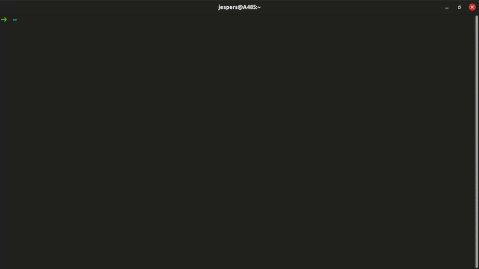

# Two years with the dev-server - part 2

So here's the second part of "two years with the dev-server". [Part 1](two-years-with-the-dev-server-part-1.html) was mostly an update on how I've tackled various obstacles, both those I faced from the very beginning, and those I crossed along the road.

This second part is about some additional things - very broad category I know - that I just really want to share.

## I completely overshot the power draw!

Shortly after my initial dev-server post I managed to get Power On Lan working, and therefore made an additional post with a new calculation of [power usage](power-savings.html):

> Based on:
> - 150 watts ON-power usage
> - 10 watts suspend-power usage
> - 40 ON-hours a week
>
> The average power usage is now down to: 43 watts - A more than 70% decrease, taking the overall monthly cost down to roughly 62 DKK (~9$) per month.

I'm a curious person. So these calculations lingered in my head for a while: I tried to be very pessimistic with my calculation, but was I close or far away from the truth? I had an idea that in reality the power usage could be way lower.

So I bought a plug-in electricity meter and meassured the power usage instead of just thinking about it - THE best way to get rid of such thoughts (I'm sure all psychiatrists agree).

Here are the results of my measurements:
- 48 watts ON-power usage*
- <1 watt suspend-power usage

With 40 ON-hours per week that's 12.2 watts on average, and a monthly power expense of 17.6 DKK (~2.5$). It goes without saying that this is VERY competitive with a VPS in the cloud. By now - after two years of service - I've definitely covered the initial costs compared to a cloud solution, and I'd probably have extra savings available that I could use on future upgrades.

_*24 idle and 72 load. The distribution is probably 10/90 or so, but I've used 50/50 in the calculation._


_Blinking LED ~ 1 watt_

## Reverse proxying (ngrok / ssh) is really useful!

I know this is not specific to having a development server, but I have really grown fond of reverse proxying.

I use it for:
1. Exposing a locally running application to a colleague
2. Testing a locally running application on a remote device
3. Sharing tmux sessions with my coworkers

Points 1 and 2 are really useful, but 3 is the best!

At my workplace we do a LOT of pairing. We use VS Code's Live Share for remote pairing, which is just about reliable enough. It is annoying, but we can live with sharing "undos" with each other, and editors getting desynced every now and then. The worst part however, is the built-in terminal. Line breaking doesn't work at all for those connecting in, and if the host is using some clever shell with predictions etc. the terminal get borderline useless.

What I do instead is:
1. Get hold of my peer's public key
2. Start a reverse proxy for port 22 (I use `ssh -R` via jsorensen.dk, but ngrok also works fine)
3. Get my peer to SSH into my dev-server, and to connect to my tmux session

The benefits are numorous:
- There are no issues with different screen sizes (tmux uses the lowest common dimensions for all participants)
- Because of the above, line breaking works great
- Scrolling works great
- The mentioned "clever shells" just work

There's a little more up-front setup to do, but the result is glorious.

Also, because the connection happens through a reverse proxy, there's no port forwarding or the like going on. When I stop `ssh -R` my dev-server is no longer accessible for inbound connections.

## I made it way easier to quickly start working

After having used the dev-server for a few months I got tired of:

1. Connect to my VPN
2. Wake the server
3. Wait for it to be ready
4. Start VS Code in the right remote folder
5. SSH into the server
6. Connect to a previous tmux, or start a tmux in the right folder
7. Detach and suspend the server when done

It was the same drill at least once and often multiple times a day.

So eventually I grew tired of it, and made some aliases for easing the process.

All I do now is:

1. Connect to VPN
2. `remote-develop [project folder]` (does all steps 2-6)
3. Detach and suspend


_`remote-develop` in action_

It might seem like a small thing, but having this command has greatly improved my ability to both get started, and especially to quickly switch between projects.

Here's the source:

```
alias wake-dev-server="ssh jeppester@192.168.0.1 \"ether-wake -i br0 -b AA:AA:AA:AA:AA:AA\""
alias ensure-dev-server-ready="until nc -zw 1 dev-server 22; do sleep 0.1; done"

remote-vscode() { code --folder-uri=vscode-remote://ssh-remote+dev-server/home/jespers/$1 }
remote-develop() {
  wake-dev-server
  ensure-dev-server-ready
  remote-vscode $1
  mosh dev-server -- zsh -c "cd $1; tmux new -A -s \`basename \$PWD\`"
}

alias suspend-server="mosh dev-server -- zsh -ic \"suspend-server\""
```

That was my longest post yet! My dev-server project really is one of my favorites, so it really didn't surprise me much that I had all this to share.

Who knows? Maybe after an additional two years I'll be back with another post. A post about how the dev-server has been left in the gutter by newer and more powerful laptops, or how I've beefed it up with shiny new hardware, or I've converted my whole workplace to similar setups. Only time will tell :-)