# The television stand

We recently moved into the house in which we want to grow old. It's a large old house with much to do!; painting everywhere, finalize all kinds of skirting* in many rooms, fix lots of partly broken / unfinished electrical switches, get reliable wired and wireless network, probably renovate the whole upper floor + much more.

Definitely a daunting abundance of stuff to do, and it's going to take a long while until things start to feel "finished". It does however also mean that stuff CAN be "finished". No "why spend time on that when we are going to move anyway" - I really like that!

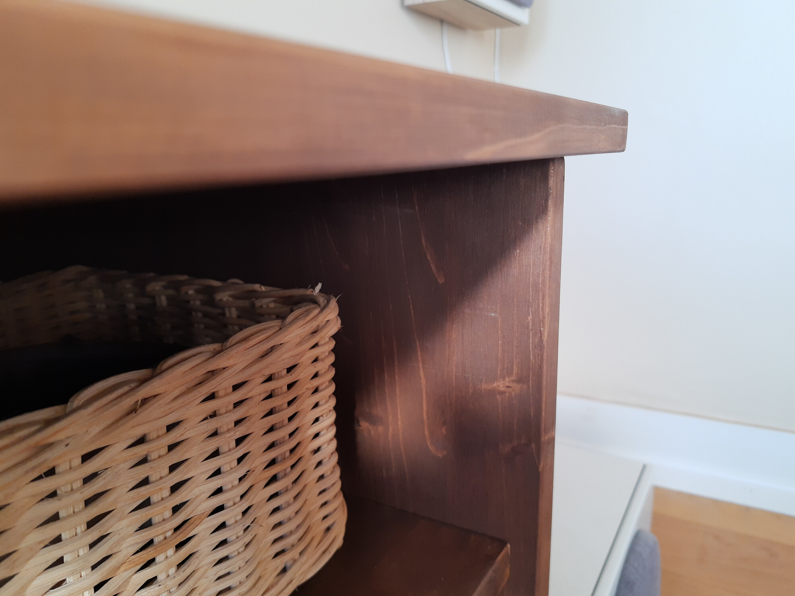
_A sexy sneakpeak! Continue reading the - admittedly overlong - intro get to get to see the result!_

It also means that I'm finally in my right to set up a decent home cinema. I've long dreamt of having a setup that blends into our living room in a good way. Something that doesn't look like your run-of-the-mill home cinema with black seats and prominent speakers everywhere, lots of black and white stuff etc.. I want a "normal" living room, but with HI-FI sprinkles so to say.

Part of achieving that is the TV stand, and that's where I faced the first real challenge. I have a center speaker which looks fine, but is kinda blocky. So it has to be "hidden" inside the furniture, but at the same time I don't like setups where everything is completely centered.

It might sound like a non-problem, but finding a piece of furniture with room for a center speaker which is not centered in the furniture is not easy. Especially if it's meant to look good. Most TV stands have 2 or 3 horizontal rooms. 2 rooms could potentially work, but the center speaker would then be placed oddly in the side of one of the rooms. 3 rooms simply is not possible with a non-centered center speaker. There where a few options with 4 horizontal rooms, but they were mostly VERY wide.

We did a very fair bit of research! looking at both used furniture, cheap IKEA - and the like - offerings, design offerings, and lastly custom made furniture. There were one or two of the design furnitures that could potentially work, and obviously custom built ones, but they were all just injustifiably (for our wallets) expensive.

Realizing that my perfectly off-centered HI-FI setup was seemingly impossible to achieve was quite a letdown for me. It made me look for other speakers, even soundbards... But it also fueled an idea that slowly crept up on me as we were looking at all those unfit for our purpose furnitures. In the back of my head I kept thinking: "If it's just a bunch of rectangular boards put together, can I not do it myself?".

Eventually I downloaded [FreeCAD](https://www.freecadweb.org/), and started playing around with boxes. The main idea was: 4 horizontal spaces, each just wide and deep enough for my center speaker (and receiver) - and then there was a max height. All of this so that the furniture would be as small as possible, while still achieving the off-center look I wanted.

After a few hours of work I had some designs ready:

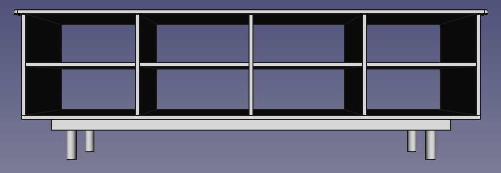
_Design 1: Happy about the rooms, but not really the plinth* above the legs_

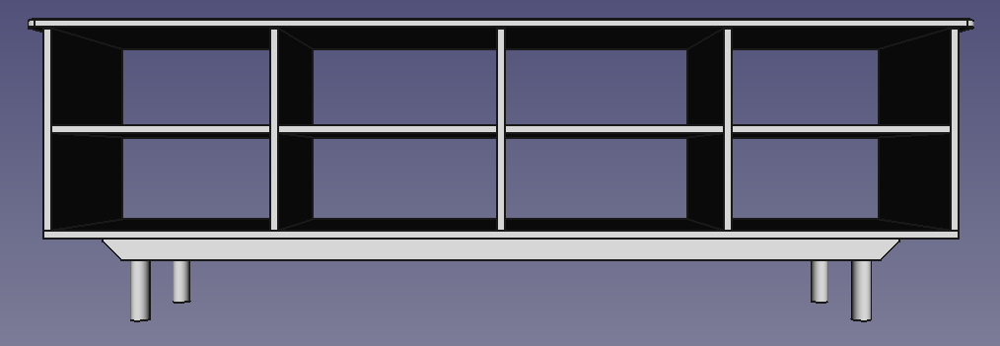
_Design 2: Rounding some corners to see if it helps_

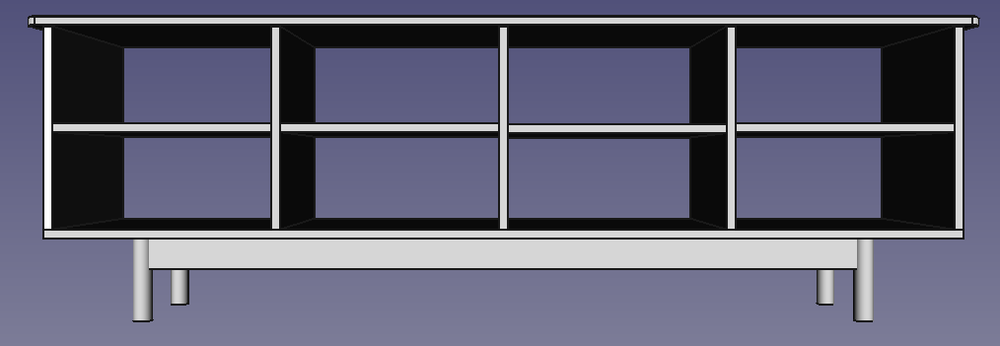
_Design 3: Less blocky, legs integrated into plinth*_

I presented each of the designs to my wife and eventually went ahead with design 3, which we both liked the most.

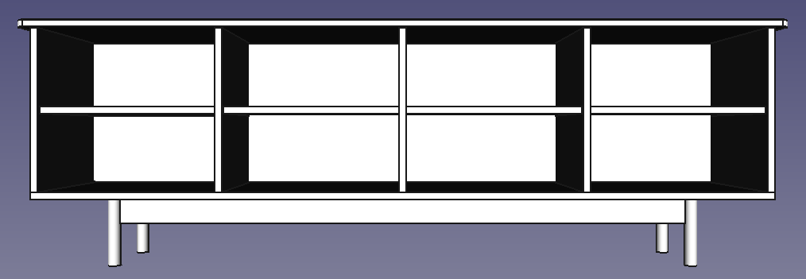
_Final design: Added missing back plate* + narrower legs_

I haven't used CAD software before, but I must say that I'm very impressed with FreeCAD. As a programmer a lot of things felt very intuitive to me.

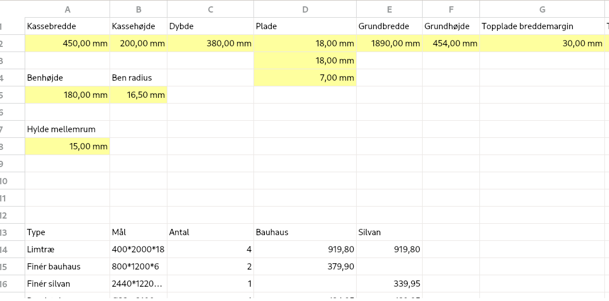
_Being able to program all of the dimensions from a spreadsheet was a great experience!_

I also found a [woodworking workbench for FreeCAD](https://github.com/dprojects/Woodworking) which allowed me to easily print a list of all the boards and their sizes:

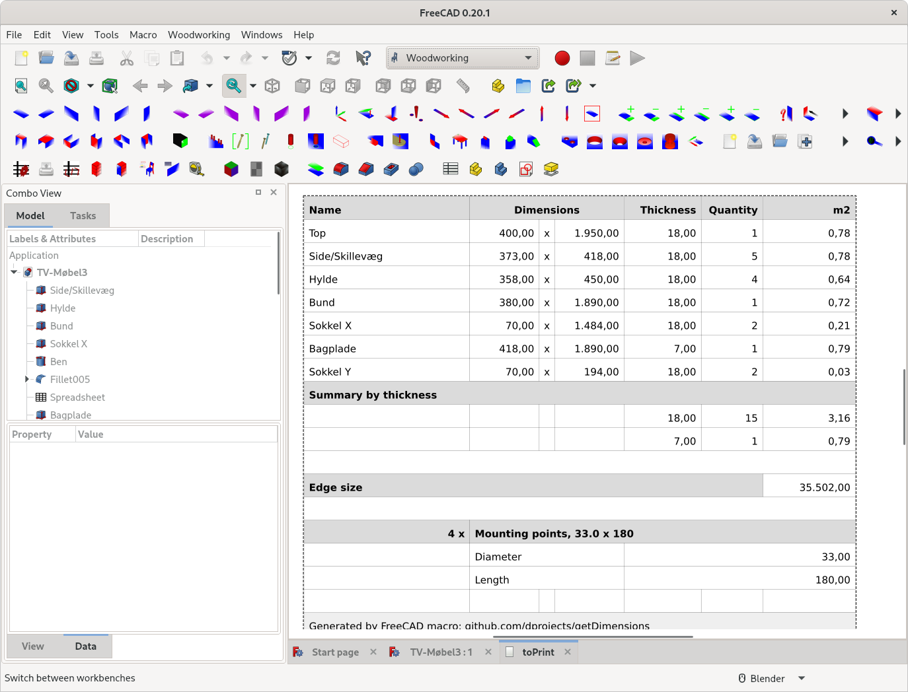
_A huge thanks to [Darek L](https://github.com/dprojects) for his work on this! - it saved me a LOTS of time._

With my order list in my hand I could then go to my local hardware store, find the correct pieces of wood and get the store personal to cut all the boards for me. It was overall a very enjoyable experience, and it was a great pleasure to finally see all the piece of my own little jigsaw puzzle ready for assembly.

I also ended up buying a dowel drill set. I wasn't planning on using dowels, but it was surprisingly approachable when I could get all the right tools in a single - and rather cheap - set. I was worried that I would regret such an impulse purchase, but I didn't at all.

Next up was setting* the dowels and getting all the piece together. Unfortunately I don't have any photos of the dowel drilling process, and assembling the plinth*, but here are some of the furniture coming together:

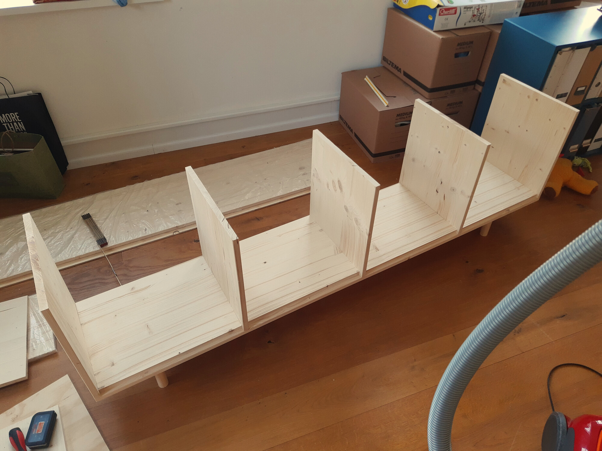
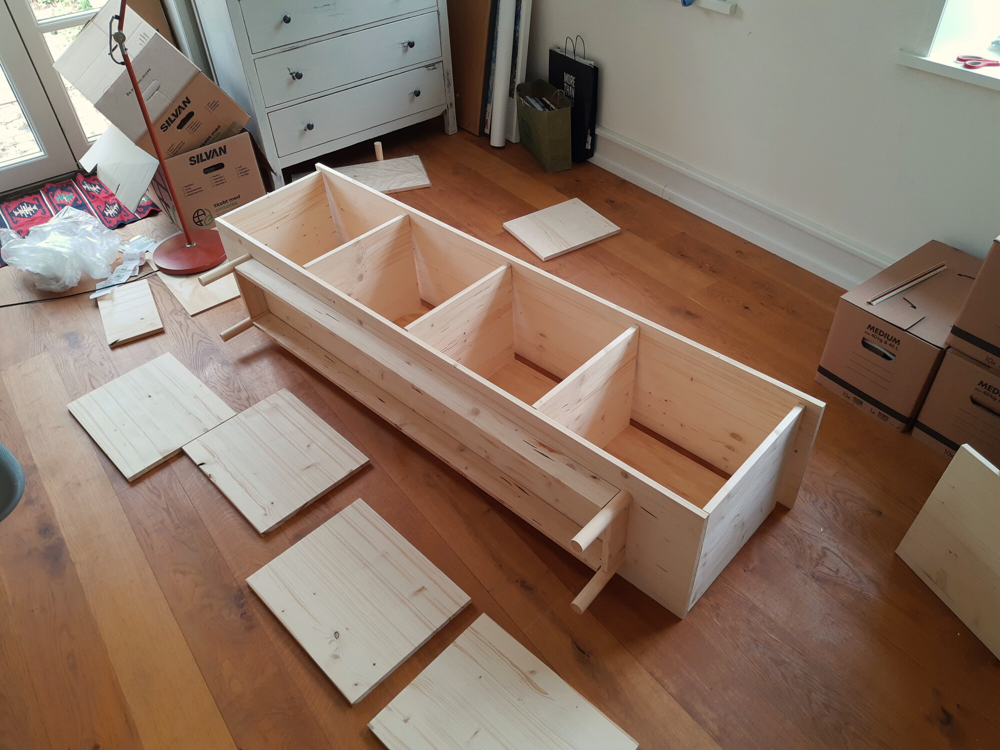
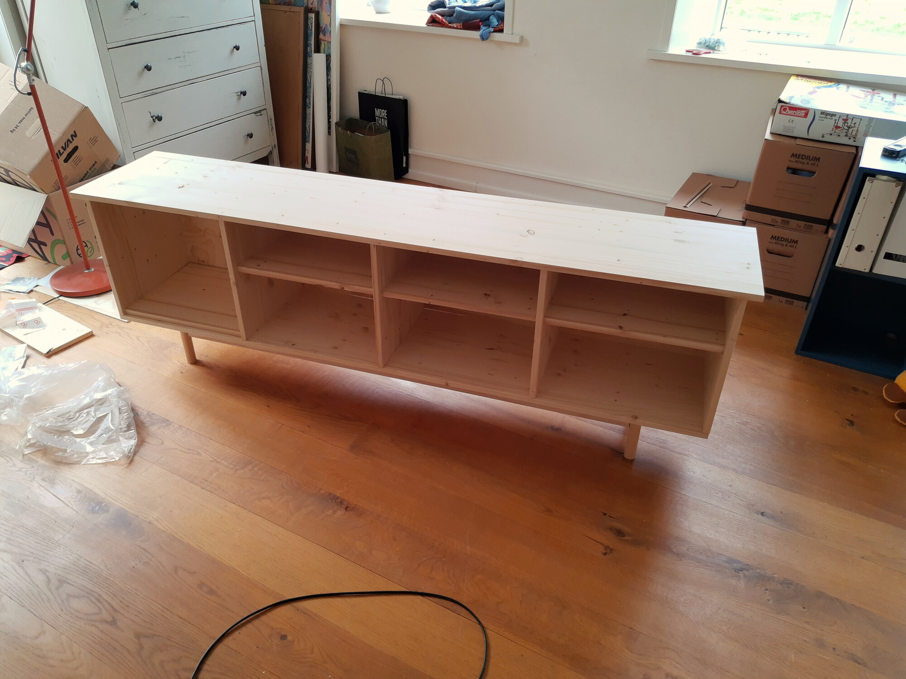

After all of the dowel holes were drilled and the furniture assembled, I dissambled it and sanded it to prepare it for a layer of stain. Sanding the roughly 8 square meters of wood by hand was by far the worst part of the work. I will buy some sort of machine for it if there's a next time for this kind of work.

Staining the wood was also a bit of a challenge because differences between thin and thick layers are very visible. I used a cloth to wipe each side very thoroughly after applying the stain. At first I was not too happy about the result, but I liked it better as it dried up.

Next up was assembling the furniture again, this time gluing all of the dowels:

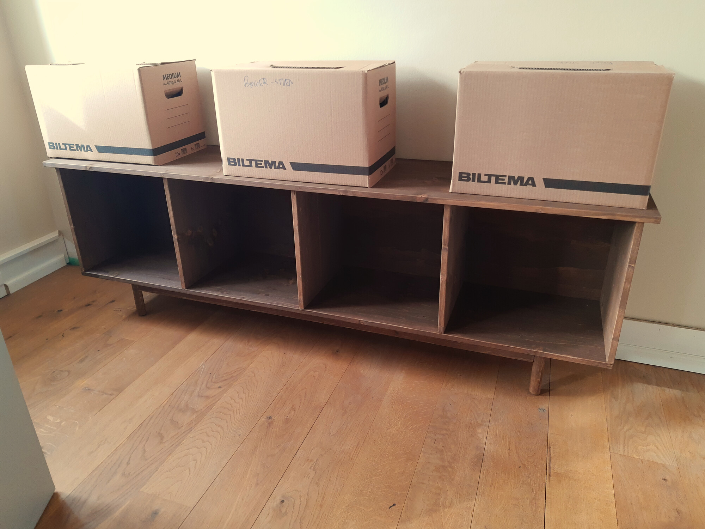
_As the glue dried the TV stand went from slightly rickety - and thus cheap feeling - to very sturdy - and expensive feeling I guess? It was definitely a pleasure to witness_

Last touch was drilling all the holes for cables and setting up the shelves, and then obviously all the cable work:

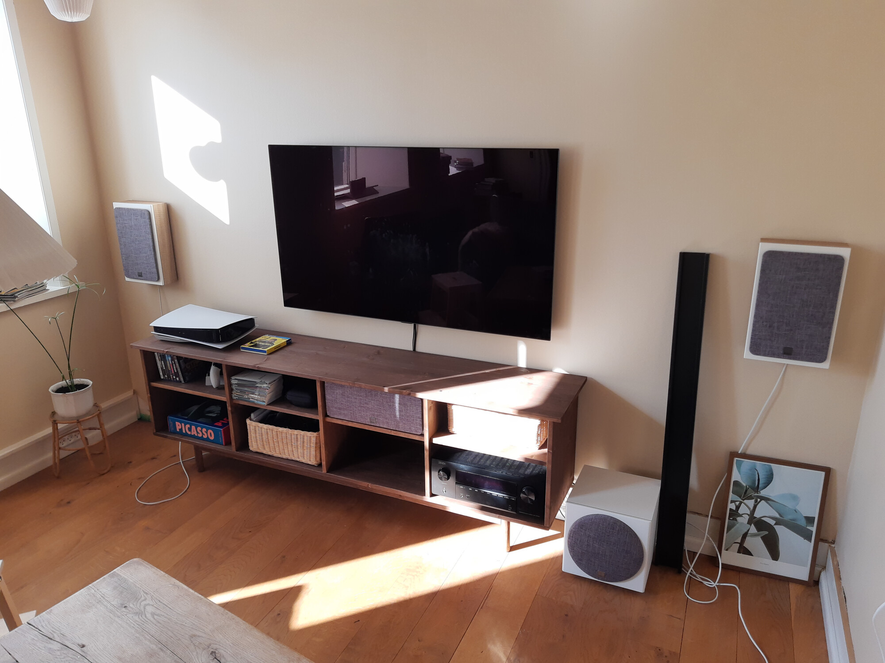
_A little bit messy from a distance_

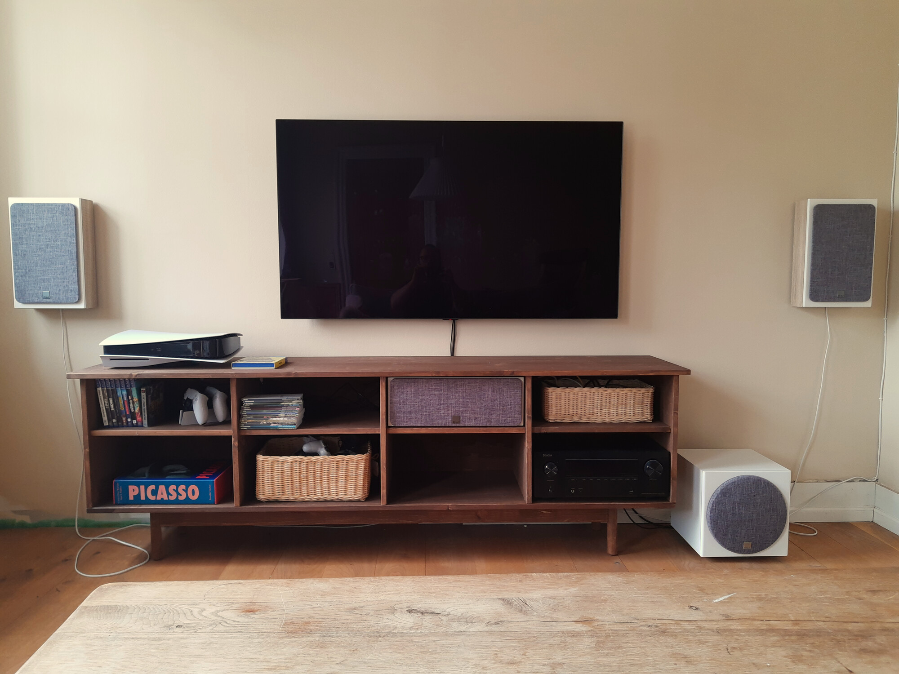
_A little bit cleaner_

There's still some work to do with the speakers and the skirting* behind the furniture. But overall I'm very happy with the result. Three weeks ago I would have never thought that I'd be ever designing and building furniture. Now I can - with a moderate to large level of pretend - call myself a furniture designer and builder!

I must say that with the help of FreeCAD, and the hardware store for cutting the boards, it was surprisingly easy to get this project done. There were many steps, and overall it took a lot of time. But I would say that each of the steps are absolutely doable for pretty much anyone.

On top of that it was also surprisingly cheap. All in all it ended up costing me ~2500 DKK, which is about the cost of a similar piece of furniture in the cheapest quality.

The only slight downside is that my wife has already started thinking up my next furniture project!

Lastly, here's [the FreeCAD file](tv-stand.FCStd)

_*This might be an incorrect term, please forgive me for my very limited wood working / home renovation vocabolary! It is subpar even in my native language._
