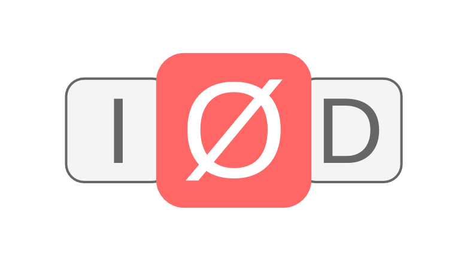

# Letter game - for my son

My four-year-old son recently started learning the alphabet!

Obviously I cannot let such a great opportunity pass, so I've started making my own small game to help him in the process:

The concept is simple: A voice pronounces a letter from the alphabet. Then the player has to pick that letter from three available choices. When the correct letter is chosen, that letter gets replaced and a new correct letter is selected from the three choices now available.

When all letters in the alphabet have been chosen, the game is over (not implemented yet, but it will surely maybe get done soon)

There are also some nice audio touches, like for instance; cheerful "success" sounds, and slightly less so failure sounds. Obviously the latter will tell which wrong letter was picked - you gotta use EVERY opportunity to teach!

Here are some things I like about this project:

- Modern web technology = no build step at all = very nice and refreshing!
- Getting to know [Audacity](https://www.audacityteam.org/) better, e.g. noise reduction, labels, multiple file export, normalization
- Hiding under a blanket while recording (to reduce background noise - or because I'm a creep 👀)
- Working with a very young audience - It is VERY difficult to nudge a four-year-old away from using a bruteforce strategy. Carefully select correct letter? nay! Thoughtlessly press all buttons? yay!.

From my many years of professional experience I've learned that you have quickly to get your product in the hands of consumers. Better ASAP learn if that product has that good market fit! So say hello to my new subdomain:

[https://lettergame.jsorensen.dk](https://lettergame.jsorensen.dk)

I even skipped the V in MVP to get it out so fast. You can expect nothing less than excellence.

FYI: It is in Danish, but just consider that an additional learning opportunity - or perhaps hard mode?

Now if only I can get my son to stop brute forcing...
