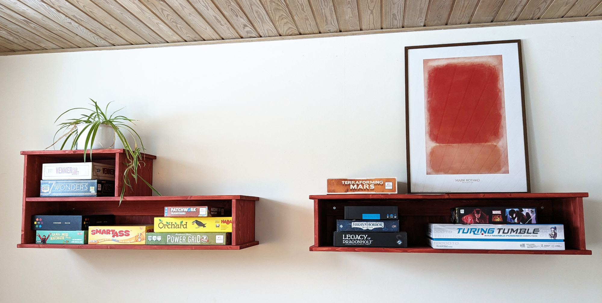
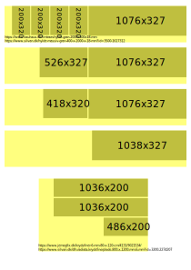
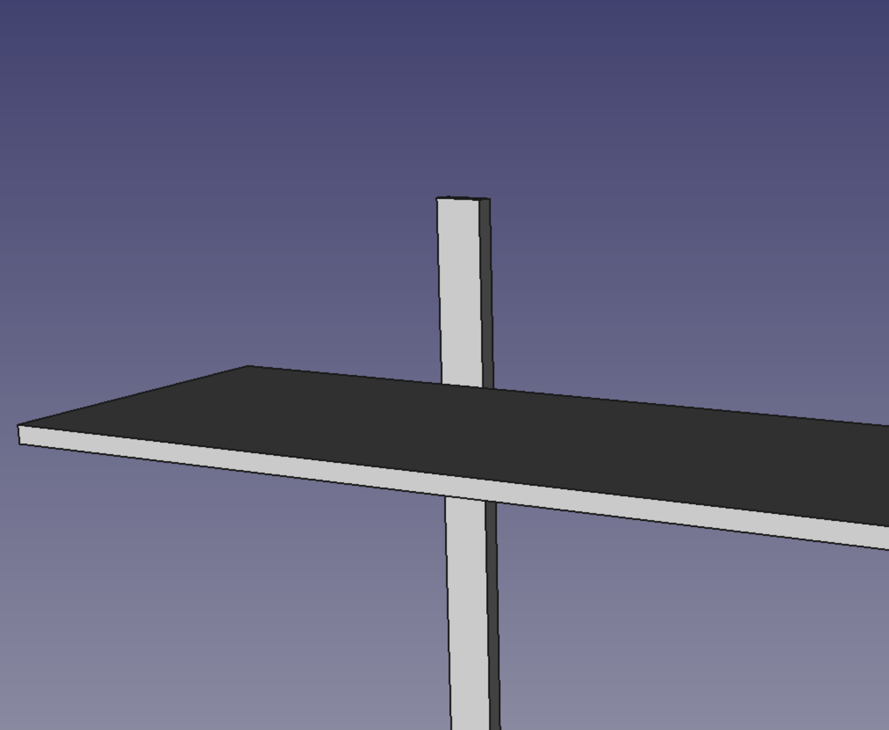

# Board game shelves

It's no secret that I'm very happy about, and tremendously proud of, my [TV-stand project](the-television-stand.html).

So it was only a matter of time before I'd built something else. Now the wait is over! I have built a new piece - or rather new pieces - of furniture.

Behold! My new board game shelves:

It is the first time I've built something which hangs on a wall, so I am very proud that they are in fact still hanging on the wall - even with the added weight of all the board games!

And now that it's been more than a handful of weeks, I'm starting to not worrying about suddenly hearing a loud bang.

Here's the plan I used for the cuts:

_I am really starting to like these glulam (limtræ) shelf pieces_

And here's [the FreeCAD file](board-game-shelves.FCStd)

And finally a "sneak peak" for my next project:

_What could it be?_

