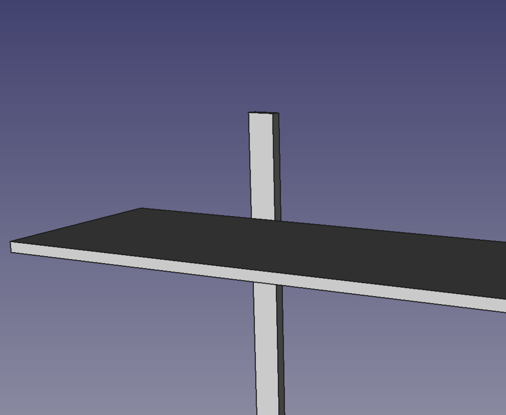
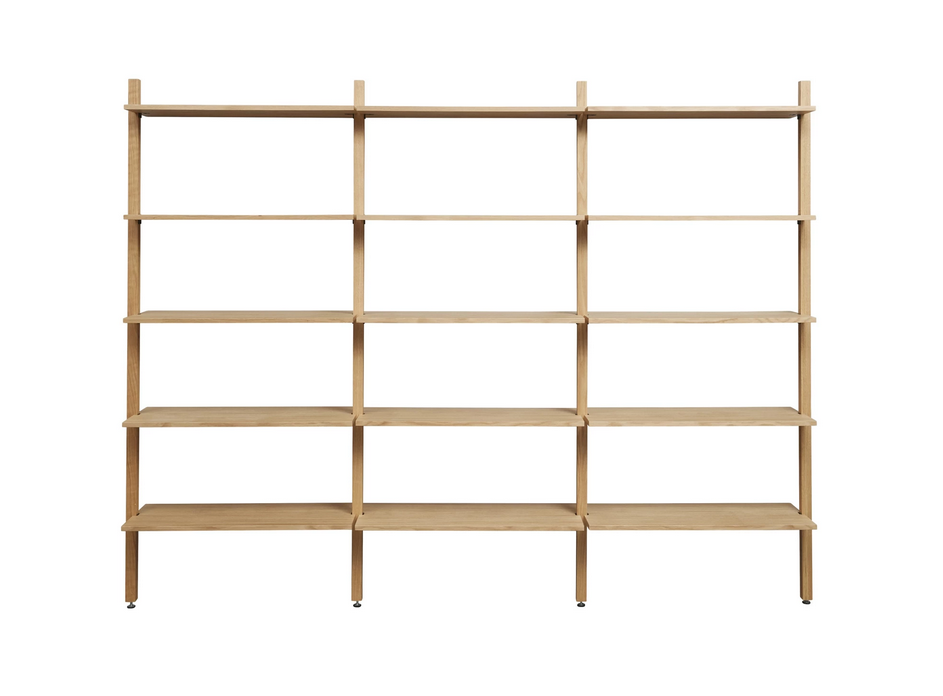
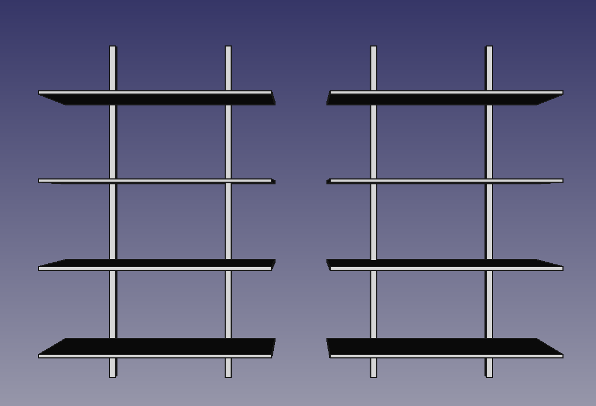
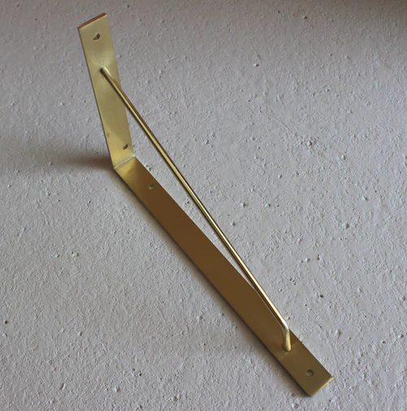
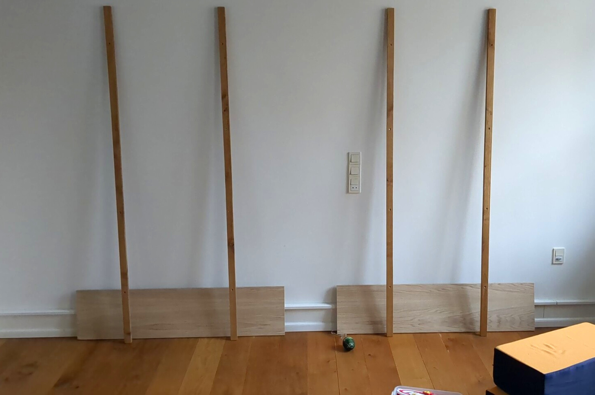
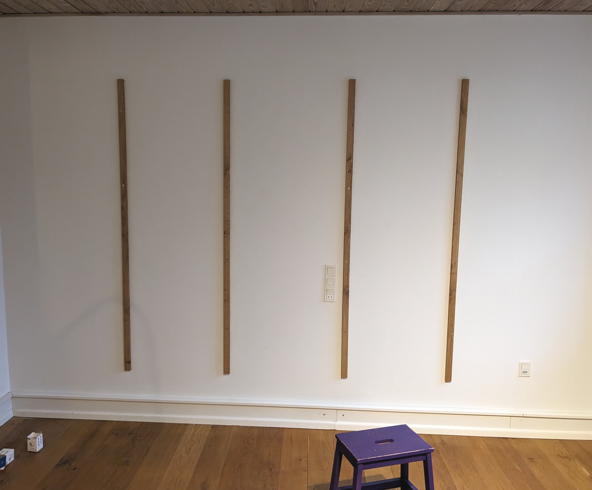
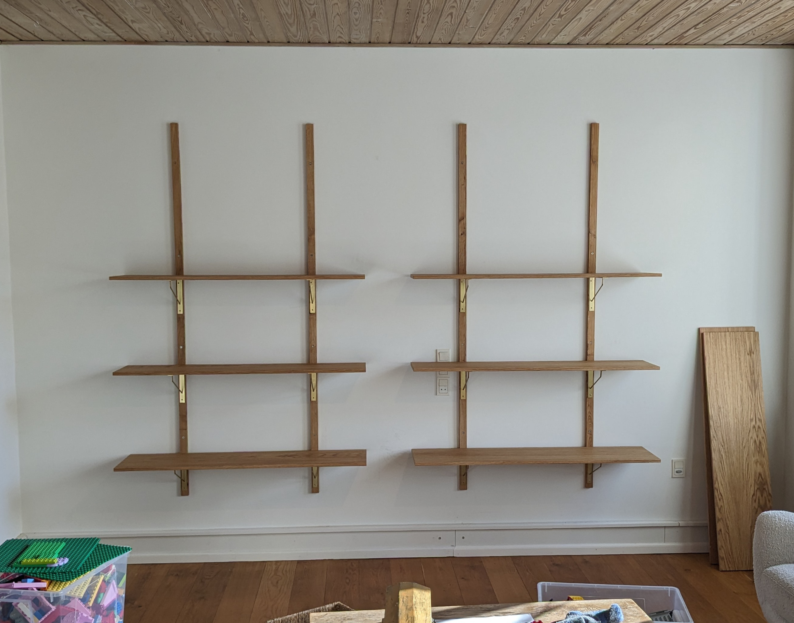
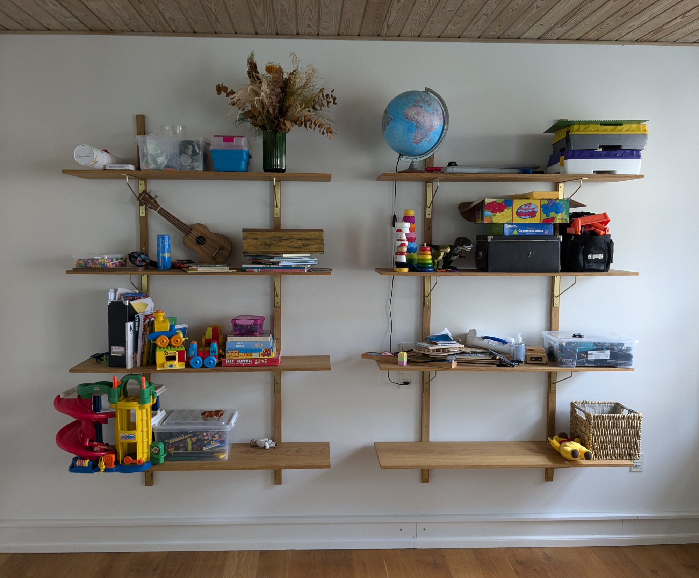

# Wall shelves

So here I am again posting about a furniture project...

My last post about [board game shelves](board-game-shelves.html) ended with a teaser:

It's been a while since then, and admittedly also since I finalized that next project, but now I've finally had time to sit down and write about it, so let's get to it!

My wife was looking for shelves for a certain wall in the house. A place to put - some of - the toys that were inhabiting the floor back then. But those shelves, they are very expensive!:

_Like this bargain for only 9999 DKK (~1400 USD/EUR)_

Then you consider how simple the construction is, and then the price gets even harder to accept.

So I opened FreeCAD and played around a bit. I wanted to make something light and simple that wouldn't be too hard to built for a hobbyist as myself.

Eventually I got to this design:

And to hold the shelves, my wife found some pretty shelf brackets:

_These were a bit expensive, and so here's a good chance to establish how I'm a victim to my wife's expensive habits. Buuut.. I'll be a good person and admit that we both strongly prefered them over the other options._

The material was also something to consider. We were lucky to have a couple of spare oak floor boards that we could use for back panels. Still we would however need to find something for the shelves themselves. We wanted to be consistent with the oak look, but solid wood boards are quite pricy, and the oak "brand" only adds to that.

At first I thought that glulam would be the best alternative, but for oak even glulam is just quite expensive. That led me to consider alternative glulam boards, but I wasn't entirely confident that it would look correct, so I kept searching.

And then I eventually discovered: Veneered MDF.

Veneered MDF is cool because it:

- Is rather cheap
- Does not have visible "seams"
- It holds the shape (better than glulam from my experience)

The only downside - for my shelves - was that the edges would need to be veneered manually. So a bit of extra work, but get a great finish, and save some money.

Unfortunately I don't have any documentation of the veneering process. What I can tell is that it seemed daunting at first, but quickly turned out to be rather easy. Don't be afraid to try it!

I did however catch some photos of putting up the shelves:

_Finding the right position for the shelves_

_Mounting the back panels on the wall_

_Mounting the actual shelves. I drilled holes for the screws in the back panels, but the oak was so hard that I broke two of the brass screws before I learned to use a larger drill._

Then you can imagine how I finished the project and put up the prettiest pieces of toys that I could find for a pretty picture. But since you are reading this I obviously did not because where is that photo?

The boring explanation is that the bracket store made a counting error, so we missed a bracket, and then everything dragged a bit, and I forgot about the pretty picture. Instead you'll get a totally authentic picture from today:

_Okay, I admit that I cleared just that bit of floor_

Which makes me wonder if the shelves did in fact result in less toys lying around... But let's get to the costs.

Here's the breakdown:

- Oak veneered MDF: 1099 DKK
- Edge veneer: 499 DKK
- (expensive) Brackets: 1920 DKK

So all in all 3518 DKK (~500 USD/EUR).

To be fair we did get a bit of "discount" for using some materials we had already (floorboard, linseed oil, wall screws), but nowhere near the amount we saved from building it ourselves.

If we'd gone with the cheapest option we considered, glulam spruce and white non-brass brackets, we could have gotten as low as 1856 DKK (~260 USD/EURO). I think the premium choices we made were absolutely worth it, but those 260 would definitely have gotten us very close to what could have been bought for 1400. That difference is eye-opening - at least to me.

And then I'm honestly much more happy about the result itself than the amount of money we saved. It is absolutely my best-looking project so far.

Here's [the FreeCAD file](shelves.FCStd)
