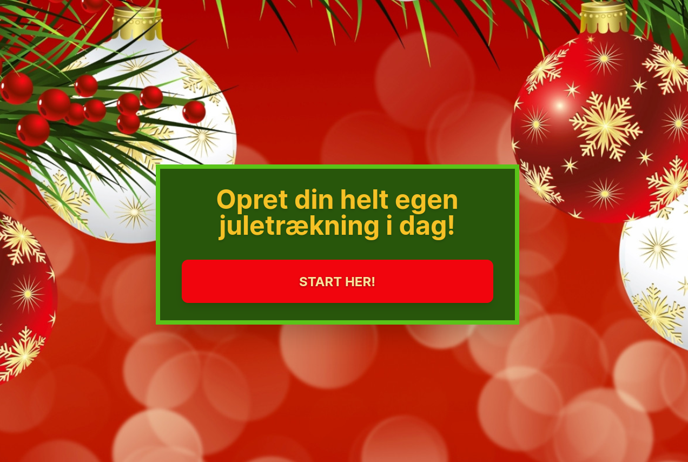
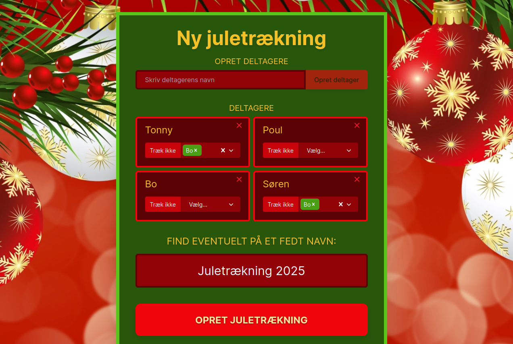
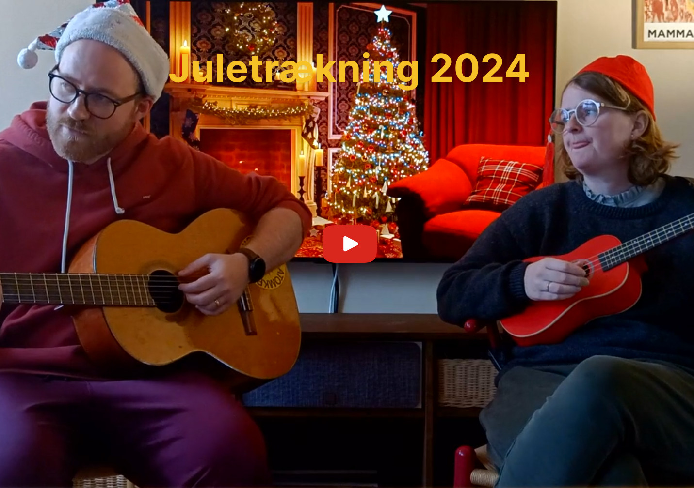
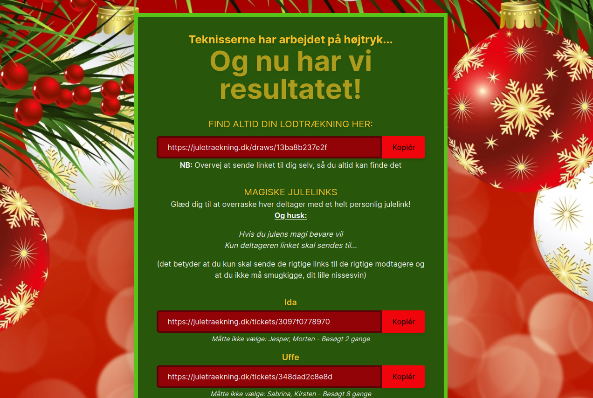

# All you wanted for Christmas was: Automated secret Santa draw

My family's been practising "Secret Santa" for a few years and it's been great! Everyone gets to focus on a single gift, the budget is good enough for gifts to be useful, and the atmosphere of secrecy up to and around Christmas is thick!

The one yearly headache is however the draw itself. First of all it's always a bit of an involved process to complete the draw as there are rules to who you can draw (obviously you can't draw yourself, and also kinda obviously nor your spouse). One illegal draw, and we need to start over, or begin a complex process of switching draws. Because we can't have anyone expose their draw result (or it would be "disclosed?" Santa, and that sounds awful).

On top of that: This year we also had the added challenge of not being able to meet up in person for the draw. Ooof what a nightmare!

I did as any inventor would do: I completely disregarded whether or not the thing I'm invented already exists (I'm 1000% sure it does), and got to work immediately.

_Say hello(-ho-ho) to [juletrækning.dk](https://juletrækning.dk)_

Create your own draw for your friends! Your draw your rules! Prevent everyone from drawing person of yesteryear, or maybe avoid that one person you'd really not want to gift anything... The challenges are many, juletrækning has the solution B-).

_And name your draw (how could I almost forget)_

Furthermore each person will get its own fancy result link with an "opposite of cringy" "music video" and a shocking reveal at the end.

_Create your own draw and get to witness this gem!_

Of course you'll also get to track if everyone opened their links - and how many times, so that you can hunt down the non-believers and the forgetful, to cleanse their souls through brunkager and glögg (losely gingerbread and eggnog).

_After so many beautiful screen shots I think it's my duty to disclose that I'm "somewhat of a designer myself"_

I realize now that it would have been so much more powerful to release this post before Christmas, but nevertheless here it was, merry Christmas!
